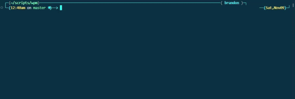
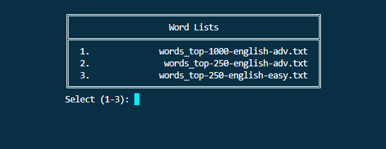

# wpm plugin
This [oh-my-zsh](https://github.com/ohmyzsh/ohmyzsh) plugin lets you test your typing speed in a terminal, track WPM, accuracy, and more. Results are saved in a handy JSON format for easy tracking.



## Setup

### oh-my-zsh
Place the `wpm` folder in `.oh-my-zsh/custom/plugins`.

Add `wpm` to the `plugins` array in your `.zshrc` file:
```
plugins=(... wpm)
```

Make sure `ZSH_CUSTOM` is set:
```
ZSH_CUSTOM="$HOME/.oh-my-zsh/custom"
```

### Required Packages
```
sudo apt install jq
```

## Usage

### Functions
Start a speed test:
```
wpm_test
```
You can set a timer if you want (default is 60):
```
wpm_test <seconds>
```

View speed test result history:
```
wpm_history
```

View average stats for every speed test:
```
wpm_stats
```


### Data

Select a word list txt file to use. Feel free to add your own lists in `wpm/lists/`.



Test results are stored in `wpm/stats/stats.json` and are organized via file name.
```
{
  "words_top-250-english-adv.txt": {
    "average": {
      "wpm": 42,
      "accuracy": 100,
      "tests taken": 1
    },
    "results": [
      {
        "date": "11/10/2024 9:12PM",
        "wpm": 42,
        "test duration": 10,
        "keystrokes": 47,
        "accuracy": 100,
        "correct": 7,
        "incorrect": 0
      }
    ]
  },
  "words_top-250-english-easy.txt": {
    "average": {
      "wpm": 69,
      "accuracy": 84,
      "tests taken": 2
    },
    "results": [
      {
        "date": "11/10/2024 9:16PM",
        "wpm": 78,
        "test duration": 10,
        "keystrokes": 79,
        "accuracy": 92,
        "correct": 13,
        "incorrect": 1
      },
      {
        "date": "11/10/2024 9:17PM",
        "wpm": 60,
        "test duration": 10,
        "keystrokes": 63,
        "accuracy": 76,
        "correct": 10,
        "incorrect": 3
      }
    ]
  }
}
```
</details>

## Configuration
Add as many txt word lists you want in `wpm/lists/`. Words must be on their own line.
