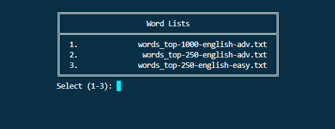

# wpm plugin
This [oh-my-zsh](https://github.com/ohmyzsh/ohmyzsh) plugin lets you test your typing speed in a terminal, track WPM, accuracy, and more. Results are saved in a handy JSON format for easy tracking.

Demo speed is 4x and does not reflect actual WPM.


## Setup

### oh-my-zsh
Place the `wpm` folder in `.oh-my-zsh/custom/plugins`.

Add `wpm` to the `plugins` array in your `.zshrc` file:
```
plugins=(... wpm)
```

Make sure `ZSH_CUSTOM` is set:
```
ZSH_CUSTOM="$HOME/.oh-my-zsh/custom"
```

### Required Packages
```
sudo apt install jq
```

## Usage

### Functions
Start a speed test via:
```
wpm_test
```
You can set a timer if you want (default is 60):
```
wpm_test <seconds>
```

View a list of speed test results via:
```
wpm_history
```


### Data

Select a word list txt file to use. Feel free to add your own lists in `wpm/lists/`.



Test results are stored in `wpm/stats/stats.json` and are organized via file name.
```
{
  "words_top-250-english-easy.txt": [
    {
      "date": "11/03/2024 10:10PM",
      "wpm": 77,
      "test duration": 60,
      "keystrokes": 406,
      "accuracy": 96,
      "correct": 77,
      "incorrect": 3
    },
    {
      "date": "11/03/2024 10:07PM",
      "wpm": 4,
      "test duration": 60,
      "keystrokes": 29,
      "accuracy": 100,
      "correct": 4,
      "incorrect": 0
    }
  ],
  "words_top-250-english-adv.txt": [
    {
      "date": "11/03/2024 10:15PM",
      "wpm": 30,
      "test duration": 60,
      "keystrokes": 275,
      "accuracy": 83,
      "correct": 30,
      "incorrect": 6
    }
  ]
}
```
</details>

## Configuration
Add as many txt word lists you want in `wpm/lists/`. Words must be on their own line.